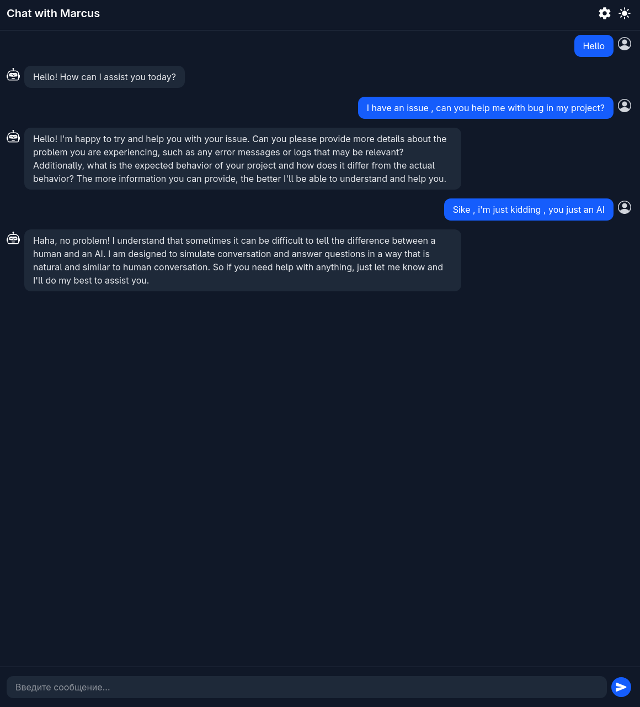
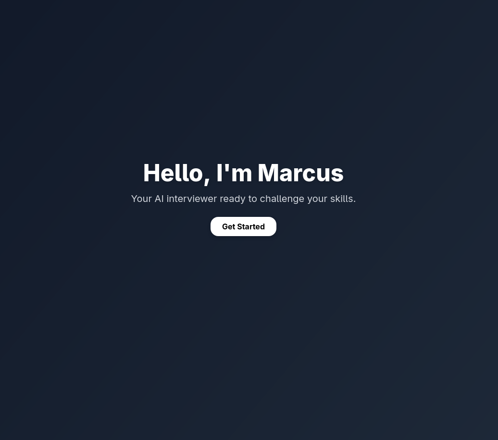
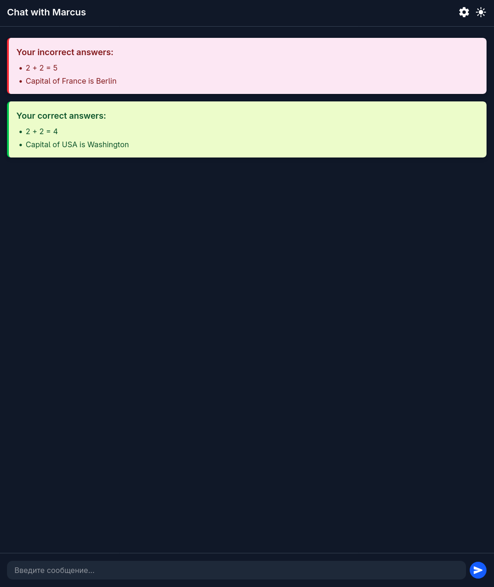

# 🧠 Marcus — AI Interviewer powered by Ollama

> **Marcus** — локальное веб-приложение, которое имитирует процесс технического собеседования.  
> Помогает разработчикам тренироваться, улучшать навыки и получать обратную связь, не выходя из дома.



---

## 🚀 Key Features
- ✅ **Полностью оффлайн** — работает на вашем компьютере без сторонних API  
- 🧠 **Генерация вопросов** с помощью Ollama и моделей типа CodeLlama  
- 💬 **Чат-интерфейс** с отправкой сообщений по Enter или кнопке  
- 🎨 **Современный UI** на TailwindCSS + `react-icons`  
- 🔧 **Backend на Express.js** для взаимодействия с Ollama  
- 🧩 Гибкая архитектура для расширений (темы, уровни сложности, логирование ответов)

---

## 🛠 Tech Stack
**Frontend:** React, Vite, Tailwind CSS, react-icons  
**Backend:** Node.js, Express.js  
**AI Model:** Ollama + CodeLlama / LLaMA3  
**Other:** REST API, Modular Architecture

---

## 📦 Installation

> Требования: **Node.js**, **Ollama**, модель `codellama:13b` или `llama3`.

### 1. Clone repository
```bash
git clone https://github.com/yourusername/marcus.git
cd marcus
```

### 2. Install dependencies

**Frontend**
```bash
cd frontend
npm install
```

**Backend**
```bash
cd backend
npm install
```

### 3. Setup Ollama
```bash
ollama pull codellama:13b
ollama run codellama:13b
```
*(Можно заменить на `llama3:13b`)*

### 4. Run Backend
```bash
cd backend
node index.js
```
Backend → [http://localhost:3001](http://localhost:3001)

### 5. Run Frontend
```bash
cd frontend
npm run dev
```
Frontend → [http://localhost:5173](http://localhost:5173)

---

## 📁 Project Structure
```
marcus/
├── backend/         # Express.js server
│   └── index.js
├── frontend/        # React app
│   ├── src/
│   ├── App.jsx
│   └── Chat.jsx, StartPage.jsx ...
└── README.md
```

---

## 📸 Screenshots
| Chat Interface | Start Page | Review |
|----------------|------------|--------|
|  |  |  

---

## 💡 Roadmap
- [ ] Переписать бэкенд на python
- [ ] Доработка логики ИИ
- [ ] Форматирование блоков кода/технических задач
- [ ] Доделать ревью ответов в конце собеседования.
- [ ] Выбор сложности (Junior / Middle / Senior)  
- [ ] Генерация тестовых задач  
- [ ] История сессий  
- [ ] Голосовой ввод и синтез речи  

---

## 🤝 Credits
- [Ollama](https://ollama.com/) — локальное выполнение LLM  
- [Meta's CodeLlama](https://huggingface.co/codellama) — языковая модель для кода  
- [React](https://reactjs.org/) + [Vite](https://vitejs.dev/) + [Tailwind CSS](https://tailwindcss.com/)  

---

📌 **GitHub Repo:** [Marcus](https://github.com/yourusername/marcus)